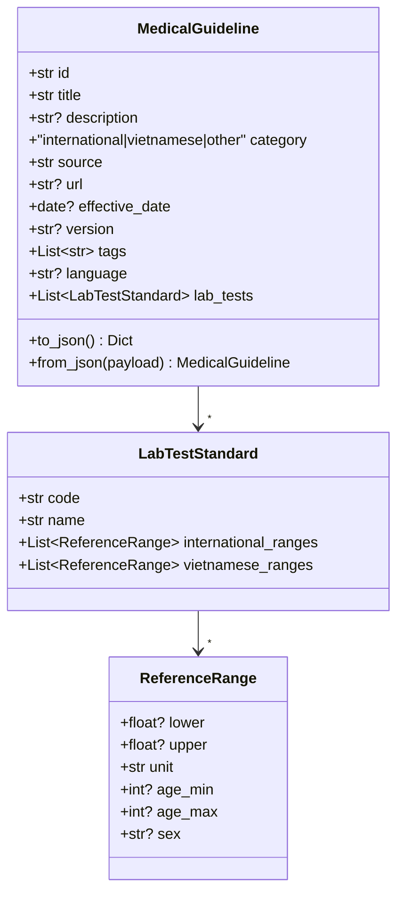

# MedicalGuideline – Clinical Standards & Laboratory Reference Ranges

`MedicalGuideline` is a Pydantic v2 model that captures high-level clinical guidelines together with laboratory test reference ranges, supporting both international (e.g., WHO, CDC) and Vietnamese standards.

---

## 1. Model Diagram



---

## 2. Top-level Guideline Fields

| Field | Type | Description |
|-------|------|-------------|
| `id` | `str` | Logical identifier for the guideline. |
| `title` | `str` | Human-readable title. |
| `description` | `str?` | Detailed description or abstract. |
| `category` | `"international" \| "vietnamese" \| "other"` | Origin classification. |
| `source` | `str` | Publishing organization (WHO, CDC, Ministry of Health VN, …). |
| `url` | `str?` | Canonical URL or PDF link. |
| `effective_date` | `date?` | Date the guideline came into effect. |
| `version` | `str?` | Version string (e.g. *2024*). |
| `tags` | `List[str]` | Free-form tags for filtering. |
| `language` | `str?` | Language code (ISO-639-1). |
| `lab_tests` | `List[LabTestStandard]` | Embedded lab-test reference standards. |

---

## 3. Laboratory Test Standards

### 3.1 LabTestStandard

Represents a single laboratory test (identified by LOINC or local code) with separate **international** and **Vietnamese** reference ranges.

| Field | Type | Description |
|-------|------|-------------|
| `code` | `str` | LOINC or custom test code. |
| `name` | `str` | Test name. |
| `international_ranges` | `List[ReferenceRange]` | Official international reference intervals. |
| `vietnamese_ranges` | `List[ReferenceRange]` | Vietnamese-specific intervals. |

### 3.2 ReferenceRange

Defines a numeric interval plus optional demographic constraints.

| Field | Type | Description |
|-------|------|-------------|
| `lower` | `float?` | Lower inclusive bound. |
| `upper` | `float?` | Upper inclusive bound. |
| `unit` | `str` | Measurement unit. |
| `age_min` | `int?` | Minimum age in years. |
| `age_max` | `int?` | Maximum age in years. |
| `sex` | `str?` | `male`, `female`, or `null` for all. |

---

## 4. Key Methods

| Method | Returns | Purpose |
|--------|---------|---------|
| `to_json()` | `dict` | Dump the guideline to a JSON-serialisable dict with camelCase aliases. |
| `from_json(payload)` | `MedicalGuideline` | Parse from previously dumped JSON. |

---

## 5. Quick Example

```python
from datetime import date
from medical_guideline import (
    MedicalGuideline, LabTestStandard, ReferenceRange
)

# WHO guideline example
who_htn = MedicalGuideline(
    id="who-htn-2024",
    title="WHO Guideline on Hypertension Management",
    category="international",
    source="WHO",
    effectiveDate=date(2024, 3, 15),
    version="2024",
    tags=["hypertension"],
    language="en",
    labTests=[
        LabTestStandard(
            code="8462-4",
            name="Systolic blood pressure",
            internationalRanges=[ReferenceRange(lower=90, upper=120, unit="mmHg")],
        )
    ],
)

# Local Vietnamese guideline with glucose range
vn_glucose = MedicalGuideline(
    id="vn-glu-2023",
    title="Vietnamese Guideline for Fasting Glucose",
    category="vietnamese",
    source="Ministry of Health Vietnam",
    effectiveDate=date(2023, 7, 1),
    version="2023",
    language="vi",
    labTests=[
        LabTestStandard(
            code="14749-6",
            name="Glucose [Moles/volume] in Blood",
            internationalRanges=[ReferenceRange(lower=3.9, upper=5.6, unit="mmol/L")],
            vietnameseRanges=[ReferenceRange(lower=4.0, upper=6.0, unit="mmol/L")],
        )
    ],
)

print(who_htn.to_json())
print(vn_glucose.to_json())
```

The resulting JSON objects can be stored or transmitted to downstream systems (e.g., CDSS, reporting engines) without losing semantic detail.
