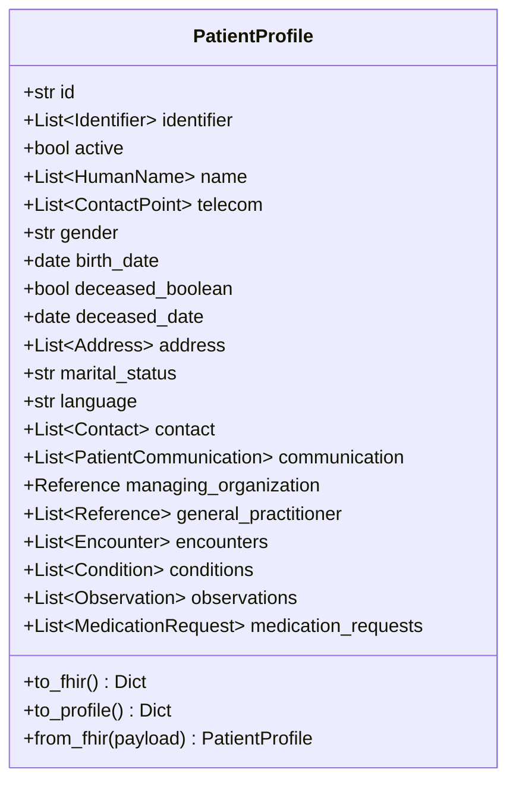

# PatientProfile – FHIR Patient Resource with Embedded Medical Record

`PatientProfile` is a Pydantic v2 model that represents the **FHIR Patient** resource (demographic information) while *embedding* the patient’s clinical record. This lets you keep all patient-related data in a single object and export it as HL7® FHIR-compliant JSON.

---

## 1. High-level Architecture



---

## 2. Demographic Fields

| Field | Type | FHIR Alias | Description |
|-------|------|-----------|-------------|
| `id` | `str` | – | Logical identifier for the patient within your system. |
| `identifier` | `List[Identifier]` | – | List of business identifiers (MRN, national ID, insurance number, …). |
| `active` | `bool` | – | Whether the record is active (default `True`). |
| `name` | `List[HumanName]` | – | Patient names. |
| `telecom` | `List[ContactPoint]` | – | Phone numbers, email addresses, etc. |
| `gender` | `str` | – | `male`, `female`, `other`, or `unknown`. |
| `birth_date` | `date` | `birthDate` | Date of birth. |
| `deceased_boolean` | `bool` | `deceasedBoolean` | Indicates if the patient is deceased. |
| `deceased_date` | `date` | `deceasedDate` | Date of death. |
| `address` | `List[Address]` | – | Patient addresses. |
| `marital_status` | `str` | `maritalStatus` | Marital status. |
| `language` | `str` | – | Default language (ISO-639-1). |
| `contact` | `List[Contact]` | – | Emergency contacts. |
| `communication` | `List[PatientCommunication]` | – | Preferred communication languages. |
| `managing_organization` | `Reference` | `managingOrganization` | Primary managing organization. |
| `general_practitioner` | `List[Reference]` | `generalPractitioner` | Primary care practitioners. |

---

## 3. Embedded Medical Record Fields

| Field | Type | Description |
|-------|------|-------------|
| `encounters` | `List[Encounter]` | Visits, admissions, or other encounters. |
| `conditions` | `List[Condition]` | Diagnoses or health conditions. |
| `observations` | `List[Observation]` | Lab results, vitals, measurements. |
| `medication_requests` | `List[MedicationRequest]` | Medication orders / prescriptions. |

Each nested resource exposes `to_fhir()` which adds its own `resourceType` and returns a FHIR-compliant dict.

---

## 4. Key Methods

### `to_fhir() -> dict`

Returns JSON for the **Patient** resource only (demographics). Clinical lists are intentionally omitted to match the FHIR Patient schema.

### `to_profile() -> dict`

Creates a FHIR **Bundle** of type `collection`:

```jsonc
{
  "resourceType": "Bundle",
  "type": "collection",
  "entry": [
    { "resource": { /* Patient */ } },
    { "resource": { /* Encounter #1 */ } },
    { "resource": { /* Condition #1 */ } },
    …
  ]
}
```

### `from_fhir(payload: dict) -> PatientProfile`

Builds a `PatientProfile` from a FHIR Patient JSON payload (clinical data must be attached manually).

---

## 5. Quick Example

```python
from datetime import date
from patient_profile import (
    PatientProfile, Identifier, HumanName, ContactPoint, Address,
    CodeableConcept, Coding, Reference, Condition
)

patient = PatientProfile(
    id="example-001",
    identifier=[Identifier(system="http://hospital", value="MRN123456")],
    name=[HumanName(family="Doe", given=["John"])],
    telecom=[ContactPoint(system="phone", value="+1-555-123-4567", use="mobile")],
    gender="male",
    birthDate=date(1990, 4, 20),
    address=[Address(city="New York")]
)

# Add a hypertension diagnosis
patient.conditions.append(
    Condition(
        id="cond-001",
        subject=Reference(reference=f"Patient/{patient.id}"),
        code=CodeableConcept(text="Hypertension"),
        clinicalStatus="active",
        onsetDate=date(2022, 1, 1),
    )
)

# Export as a FHIR Bundle
bundle = patient.to_profile()
```

The resulting Bundle can be submitted to any FHIR-compliant server.
