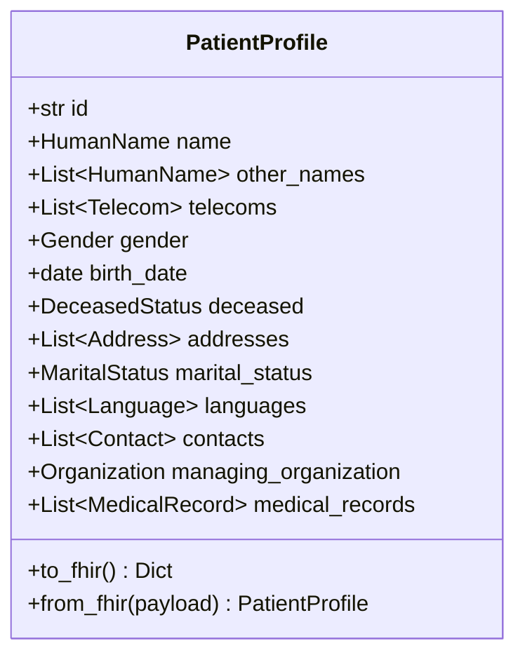

# PatientProfile – FHIR Patient Resource with Embedded Medical Record

`PatientProfile` is a Pydantic v2 model that represents the **FHIR Patient** resource (demographic information) while *embedding* the patient’s clinical record. This lets you keep all patient-related data in a single object and export it as HL7® FHIR-compliant JSON.

---

## 1. High-level Architecture



---

## 2. Demographic Fields

| Field | Type | FHIR Alias | Description |
|-------|------|-----------|-------------|
| `id` | `str` | – | Logical identifier for the patient within your system. |
| `name` | `HumanName` | – | Primary name (first & last). |
| `other_names` | `List[HumanName]` | – | Alternate names. |
| `telecoms` | `List[Telecom]` | `telecom` | Phone numbers, email, etc. |
| `gender` | `Gender` | `gender` | Constrained literal enum. |
| `birth_date` | `date` | `birthDate` | Date of birth. |
| `deceased` | `DeceasedStatus` | `deceasedBoolean` / `deceasedDate` | Death info. |
| `addresses` | `List[Address]` | `address` | Postal addresses. |
| `marital_status` | `MaritalStatus` | `maritalStatus` | Enum marital status. |
| `languages` | `List[Language]` | `communication` | Spoken languages. |
| `contacts` | `List[Contact]` | `contact` | Emergency/related contacts. |
| `managing_organization` | `Organization` | `managingOrganization` | Managing org. |
| `medical_records` | `List[MedicalRecord]` | – | Linked medical record bundles. |

---

## 3. Medical Records

Each `MedicalRecord` bundle can include encounters, conditions, observations, prescriptions, etc., and is referenced in `medical_records`.

Each nested resource exposes `to_fhir()` which adds its own `resourceType` and returns a FHIR-compliant dict.

---

## 4. Key Methods

### `to_fhir() -> dict`

Returns JSON for the **Patient** resource only (demographics). Clinical lists are intentionally omitted to match the FHIR Patient schema.

### `from_fhir(payload: dict) -> PatientProfile`

Builds a `PatientProfile` from a FHIR Patient JSON payload (clinical data must be attached manually).

---

## 5. Quick Example

```python
from datetime import date
from patient_profile import (
    PatientProfile, Identifier, HumanName, ContactPoint, Address,
    CodeableConcept, Coding, Reference, Condition
)

patient = PatientProfile(
    id="example-001",
    identifier=[Identifier(system="http://hospital", value="MRN123456")],
    name=[HumanName(family="Doe", given=["John"])],
    telecom=[ContactPoint(system="phone", value="+1-555-123-4567", use="mobile")],
    gender="male",
    birthDate=date(1990, 4, 20),
    address=[Address(city="New York")]
)

# Add a hypertension diagnosis
patient.conditions.append(
    Condition(
        id="cond-001",
        subject=Reference(reference=f"Patient/{patient.id}"),
        code=CodeableConcept(text="Hypertension"),
        clinicalStatus="active",
        onsetDate=date(2022, 1, 1),
    )
)

# Export to FHIR Patient JSON
patient_json = patient.to_fhir()
